# Food Delivery Lakehouse

An event-driven lakehouse that streams change events from an operational
PostgreSQL database into Databricks in near real time, processes them through a
medallion architecture, and closes the loop by serving the results back to an
operational Postgres store.

The domain is a food-delivery platform (customers, restaurants, products,
orders, order items). Every insert, update, and delete on the source database
is captured as a change event and flows end to end without batch extracts.

The result is a full **OLTP → OLAP → OLTP** cycle: data originates in a
transactional database, is enriched and modeled analytically in the lakehouse,
and is pushed back to a low-latency operational store for application serving.

## Architecture

```mermaid
flowchart LR
    subgraph source[Source system]
        PG[(PostgreSQL<br/>OLTP)]
        LG[load generator] --> PG
        PG -->|logical replication| DBZ[Debezium]
        DBZ --> K[Kafka]
    end

    subgraph lakehouse[Databricks lakehouse]
        K -->|Structured Streaming| BR[bronze.*_raw]
        BR -->|AUTO CDC| SLV[silver.* &#40;SCD 1 &amp; 2&#41;]
        BR -.->|invalid orders| Q[silver.orders_quarantine]
        SLV -->|materialized views| GLD[gold.* metrics]
        SLV -->|change feed → AUTO CDC| OE[gold.order_enriched]
    end

    subgraph serving[Operational serving]
        OE -->|synced table &#40;TRIGGERED&#41;| LB[(Lakebase<br/>Postgres)]
        LB --> APP[apps]
    end
```



### Source system (OLTP + CDC)

A PostgreSQL Flexible Server runs the transactional workload. Logical
replication is enabled (`wal_level = logical`) so Debezium can capture row-level
changes through the `pgoutput` plugin. A Debezium connector (running on Kafka
Connect) publishes each table's changes to its own Kafka topic
(`delivery.public.<table>`). A load generator produces realistic, continuous
traffic — creating orders, advancing their status through the delivery
lifecycle, adjusting dimension data, and injecting a small share of anomalies —
so the downstream pipeline always has a live, meaningful change stream.

### Lakehouse (medallion)

Two Lakeflow Declarative Pipelines process the stream, following the Databricks
recommendation of separating ingestion from transformation:

- **Bronze** — five streaming tables, one per source table, reading the Kafka
  topics as-is and preserving the raw Debezium change events.
- **Silver** — parses the Debezium envelope and applies `AUTO CDC`
  (`create_auto_cdc_flow`) to reconstruct current state from the change stream.
  Customers are modeled as **SCD Type 1**; restaurants, products, orders, and
  order items as **SCD Type 2**, preserving full history. Data quality is
  enforced with expectations, and invalid orders are routed to a **quarantine**
  table instead of silently dropped.
- **Gold** — business-level aggregates as materialized views (daily orders by
  restaurant, revenue by city, top products) plus a denormalized
  `order_enriched` streaming table built for low-latency serving.

### Operational serving (reverse ETL)

The `order_enriched` gold table is synced back into **Lakebase** (serverless
Postgres) as a *synced table* in incremental `TRIGGERED` mode. An application
can then query current order state — joined with customer and restaurant
context — directly from Postgres, with no analytical joins at request time.

## Concepts demonstrated

Change Data Capture (CDC) · Change Data Feed (CDF) · Lakeflow Declarative
Pipelines · `AUTO CDC` with SCD Type 1 & 2 · data quality expectations ·
quarantine pattern · materialized views · streaming tables · stream-static
joins · liquid clustering · broadcast joins · reverse ETL · Lakebase (LTAP) ·
Databricks Asset Bundles · multi-environment CI/CD · unit testing.

## Tech stack

| Layer | Technology |
|---|---|
| Source database | Azure Database for PostgreSQL Flexible Server (v16) |
| CDC | Debezium (`pgoutput`) on Kafka Connect |
| Streaming transport | Apache Kafka (KRaft) |
| Lakehouse | Databricks, Lakeflow Declarative Pipelines, Unity Catalog |
| Serving | Lakebase (serverless Postgres) |
| Infrastructure | Terraform (Azure), Docker Compose |
| Packaging & deploy | Databricks Asset Bundles |
| CI/CD | GitHub Actions |
| Tooling | uv, pytest, ruff |

## Repository structure

```
.
├── infra/                  # Terraform: Postgres, VM, networking (Azure)
├── source-system/          # CDC source: schema, Debezium, Kafka, load generator
│   ├── schema.sql          #   domain tables (REPLICA IDENTITY FULL for CDC)
│   ├── cdc-setup.sql       #   replication user + publication
│   ├── docker-compose.yml  #   Kafka + Kafka Connect + load generator
│   └── load-generator/     #   simulated OLTP traffic
├── lakehouse/              # Databricks Asset Bundle
│   ├── databricks.yml      #   bundle + dev/stg/prod targets
│   ├── pipelines/          #   bronze ingestion, silver + gold transforms
│   ├── resources/          #   pipeline, job, and Lakebase definitions
│   ├── serving/            #   synced table creation (reverse ETL)
│   ├── src/                #   shared package: schemas + pure domain logic
│   └── tests/              #   unit tests (pytest)
├── .github/workflows/      # CI (lint, test, validate) and CD (deploy)
└── docs/                   # roadmap and notes
```

## Environments and CI/CD

The lakehouse is deployed as a Databricks Asset Bundle across three
environments, each isolated in its own Unity Catalog (`food_delivery_dev`,
`food_delivery_stg`, `food_delivery_prod`) with its own Lakebase project.

Two GitHub Actions workflows drive the delivery process:

- **CI** runs on every pull request: `ruff` (lint), `pytest` (unit tests), and
  `databricks bundle validate`. Passing is required to merge.
- **CD** deploys on push, mapping each branch to its environment
  (`develop → dev`, `homolog → stg`, `main → prod`), and supports on-demand
  redeploys via `workflow_dispatch`. Production requires manual approval.

Deployments run as a dedicated **service principal**, never a personal
identity. Environment-specific values (Kafka endpoint, synced table pipeline id)
are injected at deploy time and never committed to the repository.

## Design decisions

A few choices worth calling out, with the reasoning behind them:

- **Two pipelines (ingestion vs. transformation).** Bronze is kept separate from
  silver/gold so ingestion and business logic can evolve and fail independently,
  following Databricks' recommended pattern.

- **`order_enriched` is a streaming table, not a materialized view.** The silver
  tables it derives from are produced by `AUTO CDC` and therefore receive
  MERGEs, so they are not append-only. Feeding the serving table from the
  append-only change feed (via `AUTO CDC`) keeps it compatible with standard CDF
  and enables incremental syncing to Lakebase without relying on a preview
  feature.

- **Monetary values travel as strings, then cast to `DECIMAL`.** Debezium is
  configured with `decimal.handling.mode = string`, so `NUMERIC` columns arrive
  as exact decimal strings and are cast to `DECIMAL` in silver. Floating point
  is never used for money — decimal precision is preserved end to end.

- **Quarantine over silent drops.** Orders that violate business rules (for
  example, a negative total) are written to a quarantine table rather than
  discarded, so bad data is observable and auditable instead of invisible.

- **Configuration is injected, not committed.** Environment endpoints and
  resource ids are passed at deploy time (from Terraform outputs locally, from
  GitHub environment variables in CI/CD), keeping the repository free of
  environment-specific and sensitive values.

- **Lakebase project in the bundle, synced table via CLI.** The Lakebase project
  is declared declaratively in the bundle; the synced table is created with the
  Databricks CLI, because a bundle/Terraform resource for Autoscaling synced
  tables is not yet available. The gap is documented and scripted.

## Running it

The infrastructure is ephemeral by design (provisioned, exercised, then torn
down to control cost). At a high level:

1. **Provision infrastructure** — `cd infra && ./apply.sh` creates the Postgres
   server and the VM that hosts Kafka and Debezium.
2. **Start the source system** — `cd source-system && ./setup.sh` applies the
   schema, registers the Debezium connector, and starts Kafka, Connect, and the
   load generator.
3. **Deploy the lakehouse** — the CD pipeline deploys the bundle on push, or
   `databricks bundle deploy -t <env>` deploys manually.
4. **Run the pipelines** — the bundle defines a Lakeflow Job orchestrating
   bronze → transform, schedulable or run on demand.
5. **Create the reverse ETL** — `lakehouse/serving/create_synced_table.sh <env>`
   provisions the synced table into Lakebase.

Detailed operational steps live in the runbook.

## Notes

This project runs on Databricks and Azure trial resources. Some choices — a
shared Kafka across environments, ephemeral infrastructure, public network
access tightened at the firewall — are pragmatic adaptations to that context;
the production-shaped equivalents are noted in the design decisions and roadmap.